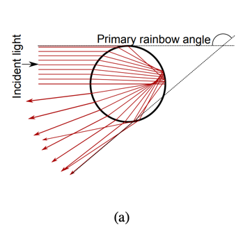
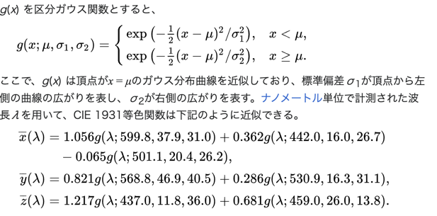
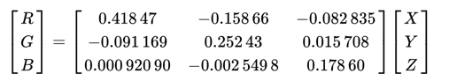

# 虹のパターンを再現するシミュレーション
## 1:概要
虹のパターンを簡単に再現するようなシミュレーションをここで解説する。<br>
本シミュレーションは、太陽光が水分子内部に屈折を伴いつつ入射し、
水分子内部で一度反射し、再度屈折を伴いつつ空気に出ることをモデル化したシミュレーションである。<br>
光は波長によって屈折率が異なるため、同じ方向から入射した光が異なる角度で反射されるため、光の色相が分離したように見れる。

## 2:数理モデル
虹が見れる基本的なメカニズムについて説明する。虹は観察者(ここではカメラ)の背面に光源があり、尚且つ空気中に水滴が分散している状態の時のみ観察される。
具体的には、観察者の後ろにある光源からの光が水滴の中で屈折と反射を起こす。光は波長により屈折率が異なるため、異なる波長の光が分解されるので虹が観察される。
### 2.1: 水滴内での屈折と反射
水滴内で光はどのように、屈折と反射を起こすのだろうか？ここでは、水分子に入射した光の経路を簡単に説明する。<br>
以下の図は、ある角度から光が水分子に入射した時の光の光路を示している(参考文献1-fig3(a))。その時に、ここでは異なる波長の光を考えずに、同じ波長の光の経路を考えている。
また、反射は一度しか考えていない(複数回の反射を考慮すると、主虹だけでなく副虹などをシミュレーションすることができる)。
水滴の上半分に入射する光しか考えていないのは、下半分に入射する光は上方向に反射し観測されないからである。<br>
<br>
上の図から、光が水分子に入射すると屈折→反射→屈折を繰り返し、光は様々な方向に分散しているのがわかる。
その分散方向には偏りがあり、一番光が反射される角度(図の右下)をその波長での反射角として近似して考える。
きちんと計算すると、赤色光(波長700nm)は屈折率1.3314で、図の反射角は137.7度になる。<br>
一方で、紫色光(波長400nm)は屈折率1.3445であり、図の反射角は139.6度になる。<br>
### 2.2: 観測者からの視点
2.1より観測者→水滴→光源のなす角度が、`40.4 (180 - 139.6) < theta < 42.3 (180 - 137.7)`の時に、その角度に応じて虹を観測することができる。 
### 2.3:波長とRGBの変換
屈折率や色彩は波長の関数であるが、ここではコンピュータグラフィクスの分野で一般的に用いられるRGBと波長の関係について記述する。
波長をRGBに変換する方法について説明する。
ここでは、[wikipedia/CIE 1931 色空間](https://ja.wikipedia.org/wiki/CIE_1931_%E8%89%B2%E7%A9%BA%E9%96%93)の内容を参考にした。
1. 波長をCIE-XYZ標色形に変換<br>
   波長をXYZ表色系に変換する関数は、上の参考資料によると、以下のように表せる。<br>
   <br>
2. XYZをRGBに変換<br>
   
## 3:実装方法
### 3.1:グリッドベースのシミュレーション
グリッドベースのシミュレーションでは、グリッドの各一点を水滴分子一つだと考えてシミュレーションを行う
(三次元上でグリッドを考えることは、水分子が平面上に壁のように存在している少し違和感のある状況ではある)。
グリッドの他に考慮しなければならないのは、光源の位置と方向、観測者(カメラ)の位置である。<br>
1. 光源→グリッドの各点→観測者のなす角度を求める。<br>
2. それらの角度から、水滴が観察者に向けて反射している光の波長を求める。<br>
3. 光の波長をRBGに変換し、グリッドに色付けする。<br>
   <br>
<details>
<summary>メインコードブロック(1,2)</summary>

```C#
using System;
using System.Collections;
using System.Collections.Generic;
using UnityEngine;

public class Rainbow : MonoBehaviour
{
    [SerializeField] private int pixelSizeX;
    [SerializeField] private int pixelSizeY;
    [SerializeField] private Light light;
    private Material _rainbowMaterial;
    private Texture2D _rainbowTexture;
    private Vector3[,] _pixelToPosition;
    void Start()
    {
        //マテリアルの取得
        _rainbowMaterial = GetComponent<MeshRenderer>().material;
        
        //テクスチャの作成とマテリアルへの登録
        _rainbowTexture = new Texture2D(pixelSizeX,pixelSizeY);
        _rainbowMaterial.mainTexture = _rainbowTexture;

        //ピクセル座標をグローバル座標に変換するリストの作成
        _pixelToPosition = CalcPixelToPosition();
    }

    // Update is called once per frame
    void Update()
    { 
        SetRainbowColorToPixel(_pixelToPosition); 
    }

    private Vector3[,] CalcPixelToPosition()
    {
        var rotation = transform.rotation;
        Vector3 baseVectorX = rotation * Vector3.left;
        Vector3 baseVectorY = rotation * Vector3.back;
        float dx = transform.localScale.x / pixelSizeX;
        float dy = transform.localScale.z / pixelSizeY;

        var pixelToPosition = new Vector3[pixelSizeX,pixelSizeY];
        var originPosition = transform.position + (- 0.5f * transform.localScale.x + 0.5f * dx) * baseVectorX + 
                             (- 0.5f * transform.localScale.y + 0.5f * dy) * baseVectorY ;
        for (var x = 0; x < pixelSizeX; x++)
        {
            for (var y = 0; y < pixelSizeY; y++)
            {
                pixelToPosition[x, y] = originPosition + dx * x * baseVectorX + dy * y * baseVectorY;
            }
        }
        return pixelToPosition;
    }

    //光が水滴(グリッドの拡張点に差し込む方向)と、水滴とカメラのベクトルがなす角度を求める。
    private void SetRainbowColorToPixel(Vector3[,] pixelToPosition)
    {
        var lightDirection = light.transform.forward;
        for (var x = 0; x < pixelSizeX; x++)
        {
            for (var y = 0; y < pixelSizeY; y++)
            {
                //光が水滴(グリッドの拡張点に差し込む方向)と、水滴とカメラのベクトルがなす角度を求める。
                var cameraToPixelDirection = (pixelToPosition[x, y] - Camera.main.transform.position).normalized;
                var rainbowAngle = 180.0f * Mathf.Acos(Vector3.Dot(lightDirection, cameraToPixelDirection))/Mathf.PI;
                //角度を波長に線型補完
                var waveLength = Fit(rainbowAngle, 40.4f, 42.3f, 400f, 700f);
                var color = new Color();
                    var rgb = ColorSpaceConverter.WaveLengthToRGB(waveLength);
                    color = new Color(rgb.x, rgb.y, rgb.z, 0);
                _rainbowTexture.SetPixel(x, y, color);
            }
        }
        _rainbowTexture.Apply();
    }
    public static float Fit(float value, float oMin, float oMax, float nMin, float nMax)
    {
        if (value < oMin) return nMin;
        if (value > oMax) return nMax;
        return nMin + (value - oMin) * (nMax - nMin) / (oMax - oMin);
    }
}
```
</details>

<details>
<summary>
波長をRGBに変換するクラス
</summary>

```C#
using System.Collections.Generic;
using UnityEngine;

public static class ColorSpaceConverter  
{
    public static Vector3 WaveLengthToXYZ(float waveLength)
    {
        return new Vector3(
            1.056f * PiecewiseGaussianFunction(waveLength, 599.8f, 37.9f,31.0f) + 0.362f * PiecewiseGaussianFunction(waveLength, 442.0f, 16.0f,26.7f) - 0.065f * PiecewiseGaussianFunction(waveLength, 501.1f, 20.4f,26.2f),
            0.821f * PiecewiseGaussianFunction(waveLength, 568.8f, 46.9f,40.5f) + 0.286f * PiecewiseGaussianFunction(waveLength, 530.9f, 16.3f,31.1f),
            1.217f * PiecewiseGaussianFunction(waveLength, 437.0f, 11.8f,36.0f) + 0.681f * PiecewiseGaussianFunction(waveLength, 450.0f, 26.0f,13.8f) 
            );
    }

    public static Vector3 XYZToRGB(Vector3 xyz)
    {
        var conversionMatrix = new Matrix3(2.36461385f, -0.89654067f, -0.46807328f, -0.51516621f, 1.4264081f,
            0.0887581f, 0.0052037f, -0.01440816f, 1.00920446f);
        return conversionMatrix * xyz;
    }

    public static Vector3 WaveLengthToRGB(float waveLength)
    {
        return XYZToRGB(WaveLengthToXYZ(waveLength));
    }
    
    private static float PiecewiseGaussianFunction(float x, float mu, float sigma1, float sigma2)
    {
        if (x < mu)
        {
            return Mathf.Exp(-0.5f * Mathf.Pow(x - mu, 2.0f)/(sigma1*sigma1));
        }
        else
        {
            return Mathf.Exp(-0.5f * Mathf.Pow(x - mu, 2.0f)/(sigma2*sigma2));
        }
    }
}
```
</details>

### 3.2:ボクセルベースのシミュレーション
各ボクセルを水滴とみなし、グリッドベースのシミュレーションと同様の容量でシミュレーションを行う。
## 4:参考文献
- 光と色彩の科学―発色の原理から色の見える仕組みまで(ブルーバックス)
- Physically-Based Simulation of Rainbows
- "虹のシミュレーション 明治大学卒業研究"
- [wikipedia/CIE 1931 色空間](https://ja.wikipedia.org/wiki/CIE_1931_%E8%89%B2%E7%A9%BA%E9%96%93)
## 5:補足
### 5.1:本シミュレーションで考慮していないこと
本シミュレーションで考慮していないことを項目に分けてここで記述する。
- 幾何光学的視点
  - 光が複数回水分子内部で反射すること<br>
    この現象を考慮していないため、本シミュレーションでは、主虹のみ再現できる。<br>
    2回反射した際の、反射角度などを知ることができれば、実装の拡張は簡単である。
- 波動光学的視点
  - 波の干渉(構造色)<br>
    複数回反射が起こると、光の光路がピッタリと重なることがありうる。<br>
    その際に、二つの光の光路長の差が光の位相の倍数であれば、波形が増幅される、
    一方、二つの光の位相が半波長分ずれると、光の波形は見えなくなる。
  - レイリー散乱<br>
  おそらく元々無視できる。空が青い理由。 
  気体分子や水分子(水滴ではない)など非常に小さいものに光がぶつかると,
  波長の大きさの4乗に反比例して散乱が起こる。そのため、波長が小さい青色光は散乱してしまい、空が青色に見える。
  - ミー散乱<br>
  牛乳や雲が白い理由。牛乳や雲には大きな分子が含まれている(コロイド？や水滴など)。
  そのため、光の波長にかかわらず、散乱が起こる。色々な光が混ざって散乱するので、白色に見える。
  - 水滴の正確な形状<br>
  本来の水滴の形状は完全な球ではない。表面張力の他に重力の影響を受けるからである。
  
### 5.2:1931 CIE色空間(表色系)とは
1931年に国際照明委員会(CIE)によって定義された色空間。複数の波長の光から構成される物理的な色と、人間の視覚が感知する色の関係を結びつけるものである。
RGB色空間とXYZ色空間が定義された。

### 5.3:Unityで行列を使用するために作成した`Matrix3`構造体
<details>
<summary>Matrix3.cs</summary>

```C#
using System.Collections;
using System.Collections.Generic;
using UnityEngine;

public struct Matrix3
{
    private float[,] _matrix;

    public Matrix3(float v11, float v12, float v13, float v21, float v22, float v23, float v31, float v32, float v33)
    {
        _matrix = new float[3, 3];
        _matrix[0, 0] = v11;
        _matrix[0, 1] = v12;
        _matrix[0, 2] = v13;
        _matrix[1, 0] = v21;
        _matrix[1, 1] = v22;
        _matrix[1, 2] = v23;
        _matrix[2, 0] = v31;
        _matrix[2, 1] = v32;
        _matrix[2, 2] = v33;
    }

    public float this[int x,int y]
    {
        get
        {
            return _matrix[x, y];
        }
        set
        {
            _matrix[x, y] = value;
        }
    }

    public static Vector3 operator *(Matrix3 matrix,Vector3 vector)
    {
        float x = matrix[0, 0] * vector[0] + matrix[0, 1] * vector[1] + matrix[0, 2] * vector[2];
        float y = matrix[1, 0] * vector[0] + matrix[1, 1] * vector[1] + matrix[1, 2] * vector[2];
        float z = matrix[2, 0] * vector[0] + matrix[2, 1] * vector[1] + matrix[2, 2] * vector[2];
        return new Vector3(x, y, z);
    }
}
```
</details>
